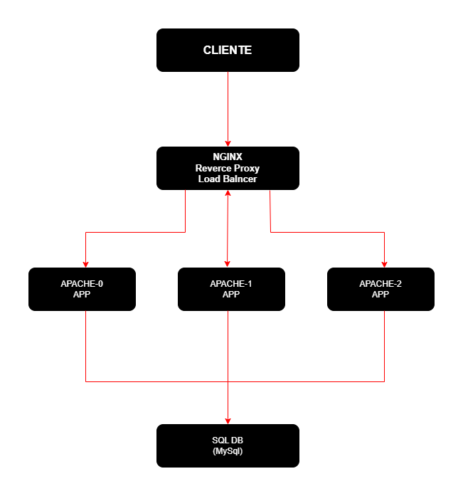

# 🏗️ Production-Ready 3-Tier Web Architecture (On-Premise)

This project demonstrates a secure and scalable 3-tier architecture deployed across 5 virtual machines:

- 🔹 NGINX Reverse Proxy + Load Balancer
- 🔹 3x Apache Web Servers (Application Layer)
- 🔹 1x Isolated Database Server (MySQL/PostgreSQL)

The design enforces strict network segmentation and access control between tiers, following production-grade security practices.

## 🎯 Why this architecture matters

This design replicates real-world production environments used in cloud platforms such as Azure and AWS.

It demonstrates:
- Layered security model
- Horizontal scaling of application tier
- Isolation of database layer
- Reverse proxy and load balancing patterns

## 🔐 Security Design

- Only NGINX is exposed to the internet
- Apache servers only accept traffic from NGINX
- Database server is isolated and only accessible from Apache tier
- No direct public access to application or database layers

## ⚙️ Tech Stack

- NGINX (Reverse Proxy / Load Balancer)
- Apache HTTP Server
- Linux (Ubuntu / AlmaLinux)
- Virtual Machines
- Network segmentation

## 🧪 Results / Tests

- Logs
- Trafico Balanceo
- Metricas

### 🔬 Load Test Results

- Requests/sec: 1200
- Latency avg: 45ms
- Distribution: Even across all Apache nodes

wrk command used:

wrk -t4 -c100 -d30s http://nginx-ip

## 💼 Skills Demonstrated

- Infrastructure design (3-tier architecture)
- Reverse proxy and load balancing (NGINX)
- Web server configuration (Apache)
- Network segmentation and security
- Linux system administration
- Performance testing with wrk

## 🔄 Future Improvements

- TLS/HTTPS termination in NGINX
- Automation with Ansible/Terraform
- Monitoring with Prometheus + Grafana
- Migration to Azure (App Gateway + App Service + Azure DB)

Sigue las instrucciones en cada archivo para configurar y realizar las pruebas correspondientes.
